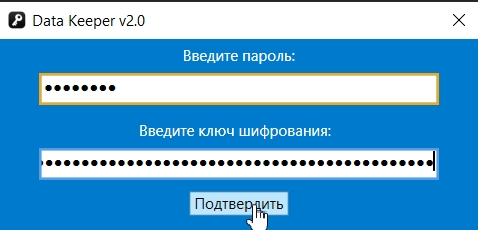
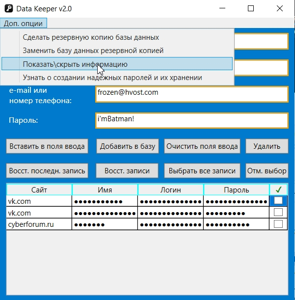

# Data Keeper v2.0
# Screenshot 1

# Screenshot 2

# Screenshot 3

# Access data
password: password  
Its hash is located in InformationForAccess.cs  
You can write any key you want in the first time. The application doesn't keep it anywhere.  
Next time if you write valid password, but wrong key data will be deciphered incorrectly.
